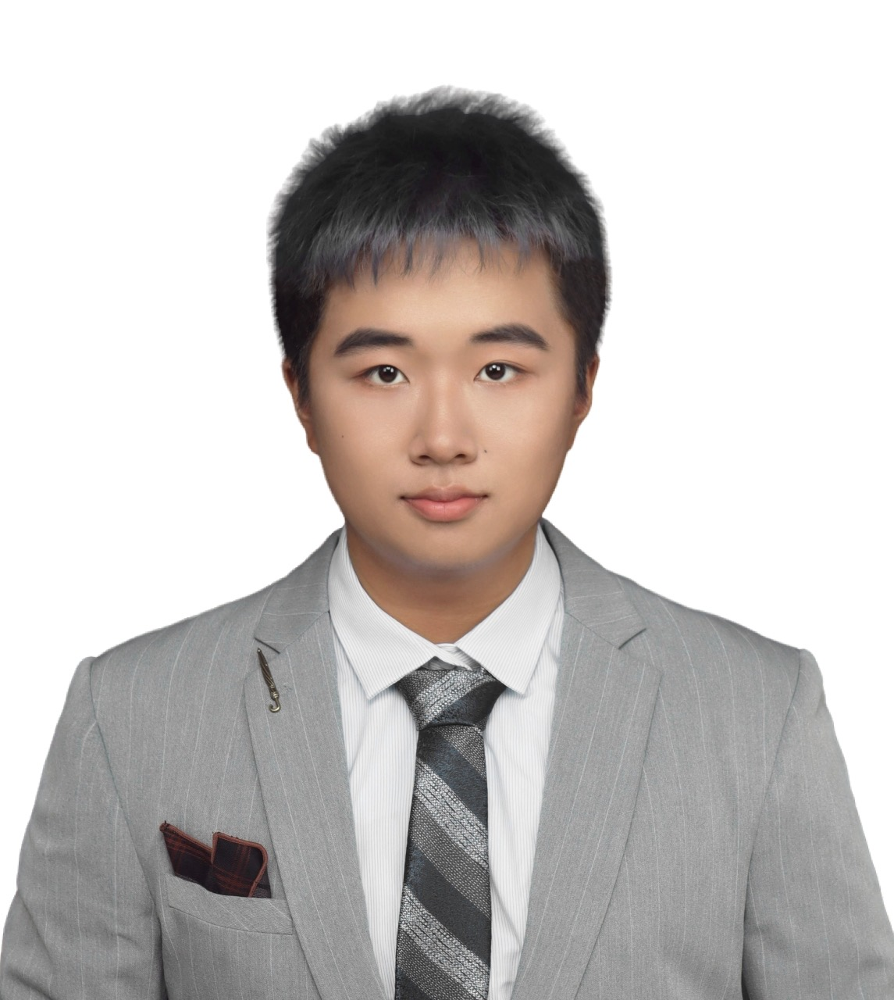

I am currently an incoming PhD student at Khoury College of Computer Sciences, Northeastern University, advised by Prof. <a href="https://zzm7000.github.io/">Ziming Zhao</a>, starting from 2026 Fall. I am a senior student at Southern University of Science and Technology, advised by Prof. <a href="https://yinqian.org/">Yinqian Zhang</a>. 
I was a research intern at UC Davis, advised by Prof. <a href="https://www.cs.ucdavis.edu/~hchen/#about">Hao Chen</a> .
Email: ruoguyang26@gmail.com

## Research Interests

- Software Security
- AI Security
- Program Analysis

## News
**2026.8**  I will join NEU(Boston) as a PhD student!

**2026.2**  I am excited to have received an offer to join the PhD program in Computer Science at Khoury College of Computer Sciences, Northeastern University, starting Fall 2026. See you in Boston!

**2026.1**  I submit my first paper as the first author to ISSTA！

**2025.6**  Excited to start my journey as a research intern at the Security Lab at UC Davis!

